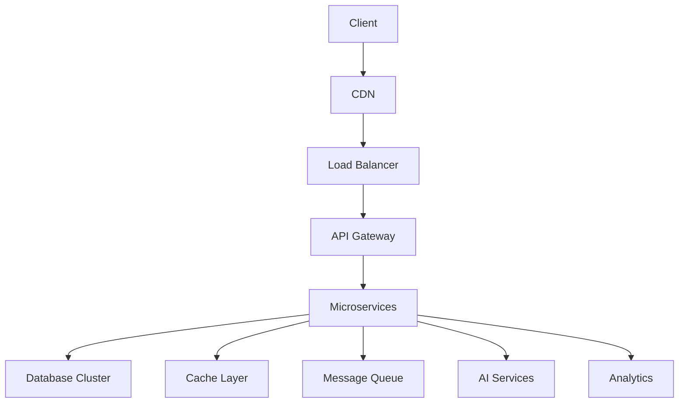

# Businessplan – Lopez IT Welt GmbH

## 1. Executive Summary

- **Unternehmen:** Lopez IT Welt GmbH
- **Geschäftsfeld:** Enterprise IT-Services & Digital Solutions
- **USP:** End-to-End Digital Transformation Partner für KMU
- **Vision:** Führender IT-Dienstleister für digitale Transformation in D/A/CH
- **Mission:** Unternehmen durch innovative IT-Lösungen zukunftssicher machen
- **Ziel:** 50.000 € monatlicher Umsatz, Profitabilität in 18 Monaten
- **Kernwerte:** Innovation, Qualität, Nachhaltigkeit, Kundenorientierung
- **Sprachen:** Deutsch & Spanisch (Muttersprache), Englisch (Schriftlicher Support)

## 🧾 Leistungsübersicht: Lopez IT Welt

Ramiro Lopez Rodriguez – Digitale Lösungen mit Verstand & Verantwortung

### Leistungsübersicht nach Ort der Durchführung

#### 🏢 Nur Remote / In der Firma möglich:

| Bereich                         | Beschreibung                                                      |
| ------------------------------- | ----------------------------------------------------------------- |
| 🌐 Webdesign                    | Gestaltung, Umsetzung & Pflege von Webseiten                      |
| 🧠 KI-Assistenz                 | Automatisierung, Text-/Datenverarbeitung, Chatbot-Integration     |
| 📝 Formular-Ausfüllen (digital) | Online-Formularservice für Ämter, Behörden, Bewerbungen           |
| 💻 Remote-Support               | Fernwartung, Softwarehilfe, Systemoptimierung per TeamViewer etc. |

#### 🚗 Nur Vor-Ort möglich:

| Bereich                    | Beschreibung                                            |
| -------------------------- | ------------------------------------------------------- |
| 🖥️ PC-Bau & Einrichtung    | Zusammenbau, Lieferung, Einrichtung & Erklärung         |
| 💼 Hardware-Support        | Fehlerdiagnose, Austausch & Wartung direkt beim Kunden  |
| 📄 Formular-Hilfe (analog) | Ausfüllen & erklären vor Ort – für Menschen ohne PC     |
| 🖨️ Druck & Postversand     | Ausdruck von Dokumenten, Umschlag, Briefversand (lokal) |

#### 🔄 Flexibel: Remote und Vor-Ort möglich

| Bereich                   | Beschreibung                                                        |
| ------------------------- | ------------------------------------------------------------------- |
| 💼 Allgemeiner IT-Support | Persönlich oder via Fernwartung                                     |
| 🧠 KI-Einrichtung         | Remote möglich, aber vor Ort erklärbar (für Einsteiger ideal)       |
| 📱 Geräte-Einrichtung     | Smartphones, Tablets, WLAN – nach Wunsch vor Ort oder via Anleitung |

### ✅ Professionelle Preisübersicht

#### 🏢 Remote / In der Firma

| Leistung                  | Preis              |
| ------------------------- | ------------------ |
| Webdesign (einfach)       | 500 – 800 €        |
| Webdesign (barrierefrei)  | 800 – 1.200 €      |
| SEO-Grundoptimierung      | 200 – 300 €        |
| Mehrsprachige Erweiterung | +200 € pro Sprache |
| KI-Assistenz (Formulare)  | 40 – 50 €/Stunde   |
| KI-Tools Einrichtung      | 40 – 50 €/Stunde   |
| Digitaler Formularservice | 35 – 45 €/Stunde   |
| Remote-Support            | 35 – 45 €/Stunde   |

#### 🚗 Vor-Ort Service

| Leistung                | Preis                |
| ----------------------- | -------------------- |
| PC-Zusammenstellung     | 50 € (Pauschal)      |
| PC-Aufbau & Einrichtung | 80 – 100 €           |
| Hardware-Support        | 45 – 50 €/Stunde     |
| Formular-Hilfe vor Ort  | 40 – 50 €/Stunde     |
| Druck & Postversand     | 5 – 10 € pro Sendung |

#### 🖨️ Drucken & Kopieren

| Leistung               | Preis              |
| ---------------------- | ------------------ |
| Schwarz/Weiß A4        | 0,25 € pro Seite   |
| Farbkopie A4           | 0,60 € pro Seite   |
| Ab 50 Stück (s/w)      | 0,20 € pro Seite   |
| Ab 250 Stück (s/w)     | 0,15 € pro Seite   |
| Ab 500 Stück (s/w)     | 0,12 € pro Seite   |
| Dickeres Papier        | +0,15 € pro Seite  |
| Folie                  | +0,50 € pro Seite  |
| Vergrößern/Verkleinern | +0,50 € pro Seite  |
| Schneiden              | 0,30 € pro Schnitt |
| Scannen                | 2,00 € pro 10 Min  |

#### Flexible Services

| Leistung           | Remote      | Vor-Ort     |
| ------------------ | ----------- | ----------- |
| IT-Support         | 40 – 50 €/h | 45 – 50 €/h |
| KI-Einrichtung     | 40 – 50 €/h | 45 – 50 €/h |
| Geräte-Einrichtung | 35 – 45 €/h | 40 – 50 €/h |
| Systemoptimierung  | 40 €/h      | 45 €/h      |

### 💼 1. IT-Dienstleistungen & Support

- Einrichtung & Wartung von Windows-PCs, Netzwerken & Peripherie
- Hilfe bei Softwareproblemen & Systemoptimierung
- Datenschutzkonforme Systemkonfiguration (DSGVO)
- Barrierefreie Systeme für Senioren & Menschen mit Einschränkungen

### 🖥️ 2. Individueller PC-Bau & Hardware-Beratung

- Zusammenstellung & Bau von PCs (Office, Gaming, barrierefrei)
- Günstiger Einkauf & faire Preisgestaltung (inkl. Aufbau & Einrichtung)
- Vor-Ort-Service oder Lieferung (inkl. Erklärung & Inbetriebnahme)
- Nachhaltige Aufrüstung älterer Geräte

### 🌐 3. Webdesign & Automatisierung

- Erstellung moderner, barrierefreier Webseiten (inkl. SEO-Grundlagen)
- Integration von KI-gestützten Automatisierungen (z. B. für Formulare, Bewerbungen, Inhalte)
- Umsetzung mit modernem Stack (Next.js, Tailwind, Markdown + CMS)
- Mehrsprachige Webseiten (z. B. Deutsch / Spanisch)

### 🧠 4. KI-Assistenz & Automatisierung

- Automatisierte Prozesse: Text, Formulare, Datenpflege
- Hilfe beim Einstieg in KI-Nutzung (z. B. ChatGPT, Cursor, Copilot)
- Barrierefreies Bewerbungsdesign (inkl. automatisierter Lebenslauf-Erstellung)
- Persönliche KI-Tools zur Arbeitserleichterung

### 📝 5. Formularservice & Druckdienste

- Hilfe beim Ausfüllen offizieller Formulare (Agentur für Arbeit, Krankenkasse, Ämter)
- Erklärungen auf Deutsch / Spanisch
- Ausdruck & Postversand von Anträgen
- Vor-Ort-Service für Menschen ohne PC oder Drucker

### 🎯 Alleinstellungsmerkmale

- Barrierefreiheit & persönliche Hilfe im Fokus
- Technik + Menschlichkeit vereint (verständliche Sprache, echte Begleitung)
- Spanischsprachige Unterstützung möglich
- Eigene Erfahrungen mit Krankheit & Arbeitslosigkeit – echtes Verständnis für Kunden in schwierigen Situationen

## 2. Marktanalyse & Strategie

### 2.1 Marktvolumen & Trends

- **Managed Services:** 8 Mrd. € (2024), 12% CAGR
- **Cloud Services:** 5 Mrd. € (2024), 15% CAGR
- **IT-Security:** 3 Mrd. € (2024), 20% CAGR
- **Digital Transformation:** 10 Mrd. € (2024), 18% CAGR
- **KI & Automation:** 4 Mrd. € (2024), 25% CAGR

### 2.2 Zielgruppen-Segmentierung

| Segment         | Größe | Bedürfnisse     | Potenzial | Strategie        |
| --------------- | ----- | --------------- | --------- | ---------------- |
| KMU (5-50 MA)   | 45%   | Basis-IT, Cloud | Hoch      | Standard-Pakete  |
| KMU (51-200 MA) | 35%   | Enterprise-IT   | Sehr Hoch | Custom Solutions |
| Startups        | 20%   | Agile IT        | Mittel    | Flexible Modelle |

### 2.3 Wettbewerbsanalyse

- **Direkte Konkurrenz:**
  - Bechtle/Cancom (Marktführer)
  - Regionale MSPs
  - Cloud-Spezialisten
- **Indirekte Konkurrenz:**
  - Inhouse-IT
  - Freelancer
  - Cloud-Provider
- **Differenzierung:**
  - End-to-End Lösungen
  - KI-Integration
  - Nachhaltigkeit
  - Lokale Präsenz

### 2.4 Markteintrittsstrategie

1. **Phase 1:** Nischenbesetzung (Q2 2025)
   - Fokus auf Cloud-Migration
   - Security-First-Ansatz
   - KI-Integration
2. **Phase 2:** Marktexpansion (Q3-Q4 2025)
   - Geografische Expansion
   - Service-Portfolio-Erweiterung
   - Partner-Netzwerk
3. **Phase 3:** Skalierung (2026)
   - Internationale Expansion
   - Produkt-Entwicklung
   - M&A-Optionen

## 3. Geschäftsmodell & Erlösströme

### 3.1 Service-Portfolio

| Service                | Modell  | Preis        | Zielgruppe    | Features                           |
| ---------------------- | ------- | ------------ | ------------- | ---------------------------------- |
| Managed Services       | Abo     | 50-150€/User | Alle KMU      | 24/7 Support, Monitoring           |
| Cloud-Consulting       | Projekt | 1.000€/Tag   | Enterprise    | Migration, Security                |
| SaaS-Dashboard         | Abo     | 20€/Seat     | Alle          | Analytics, Reporting               |
| Digital Shop           | Einmal  | 10-200€      | Alle          | Downloads, Support                 |
| Webinare               | Ticket  | 100-500€     | Alle          | Live, Recording                    |
| Mehrsprachiger Support | Stunde  | 80-120€      | DE/ES         | Deutsch & Spanisch (Muttersprache) |
| Schriftlicher Support  | Stunde  | 60-80€       | International | E-Mail Support auf Englisch        |

### 3.2 Erlösmodell

- **Recurring Revenue:** 70%
  - Managed Services: 40%
  - SaaS-Dashboard: 20%
  - Support: 10%
- **Projektgeschäft:** 20%
  - Cloud-Migration: 10%
  - Consulting: 10%
- **Produktverkauf:** 10%
  - Digital Products: 5%
  - Hardware: 5%

### 3.3 Kundenlebenszyklus

1. **Akquise:**
   - Marketing Automation
   - Lead Scoring
   - Sales Pipeline
2. **Onboarding:**
   - 30-Tage-Prozess
   - Success Metrics
   - Feedback Loop
3. **Betreuung:**
   - SLA-Management
   - Proactive Support
   - Health Checks
4. **Upselling:**
   - Cross-Selling
   - Feature-Upgrades
   - Service-Erweiterung
5. **Retention:**
   - Customer Success
   - Loyalty Program
   - Referral System

## 4. Technische Architektur

### 4.1 System-Architektur



### 4.2 Technologie-Stack

- **Frontend:**
  - Next.js 14 (React)
  - TypeScript
  - Tailwind CSS
  - Framer Motion
  - Jest/Testing Library
  - Storybook
  - Cypress
- **Backend:**
  - NestJS
  - PostgreSQL
  - Redis
  - GraphQL
  - REST APIs
  - gRPC
  - Kafka
- **DevOps:**
  - GitHub Actions
  - Kubernetes
  - AWS EKS
  - Terraform
  - Prometheus/Grafana
  - ELK Stack
  - Jaeger

### 4.3 Sicherheitsarchitektur

- **Infrastructure:**
  - VPC mit Private Subnets
  - Security Groups
  - WAF (AWS Shield)
  - DDoS Protection
  - Network ACLs
  - VPN Access
- **Application:**
  - OWASP Top 10
  - Penetration Testing
  - Code Scanning
  - Dependency Checks
  - SAST/DAST
  - IAST
- **Data:**
  - Encryption at Rest
  - Encryption in Transit
  - Backup Strategy
  - Data Retention
  - GDPR Compliance
  - Data Classification

## 5. Organisationsstruktur

### 5.1 Team-Struktur

```
CEO
├── CTO
│   ├── Development
│   │   ├── Frontend
│   │   ├── Backend
│   │   └── Mobile
│   ├── DevOps
│   │   ├── Infrastructure
│   │   ├── Security
│   │   └── Monitoring
│   └── Architecture
│       ├── System Design
│       ├── Security
│       └── Performance
├── COO
│   ├── Operations
│   │   ├── Service Desk
│   │   ├── NOC
│   │   └── Support
│   ├── Quality
│   │   ├── QA
│   │   ├── Testing
│   │   └── Compliance
│   └── Process
│       ├── ITIL
│       ├── Agile
│       └── Documentation
└── CMO
    ├── Marketing
    │   ├── Digital
    │   ├── Content
    │   └── Events
    ├── Sales
    │   ├── Enterprise
    │   ├── SMB
    │   └── Channel
    └── Customer Success
        ├── Onboarding
        ├── Support
        └── Retention
```

### 5.2 Stellenbeschreibungen

#### CTO

- **Aufgaben:**
  - Technische Strategie
  - Architektur-Entscheidungen
  - Team-Leadership
  - Innovation
  - Security
- **Anforderungen:**
  - 10+ Jahre IT-Erfahrung
  - Cloud-Expertise
  - Leadership-Skills
  - Security-Knowledge
  - Architecture-Patterns
- **Gehalt:** 120.000-150.000 €
- **Benefits:**
  - Equity
  - Bonus
  - Car
  - Insurance

#### Lead Developer

- **Aufgaben:**
  - Architektur-Design
  - Code-Reviews
  - Team-Mentoring
  - Best Practices
  - Performance
- **Anforderungen:**
  - 5+ Jahre Erfahrung
  - Full-Stack
  - Cloud-Native
  - Microservices
  - Security
- **Gehalt:** 85.000-100.000 €
- **Benefits:**
  - Remote
  - Flexible Hours
  - Learning Budget
  - Conference Budget

---

_Dieser Businessplan wird regelmäßig aktualisiert. Letzte Änderung: 2024-03-19_
