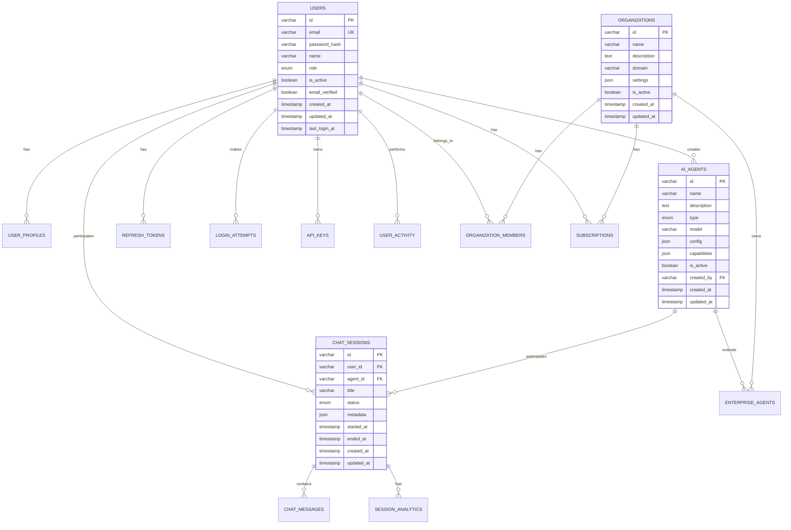

# 🗄️ Datenbank-Schema - Lopez IT Welt

**Version:** 1.0  
**Datum:** 2025-07-05  
**Status:** 🚧 IN ENTWICKLUNG  
**Datenbank:** MySQL 8.0  
**Autor:** Lopez IT Welt Team

## 📋 **ÜBERSICHT**

Das **Datenbank-Schema** definiert die vollständige Struktur der MySQL-Datenbank für das Lopez IT Welt System. Es folgt den Best Practices für Normalisierung, Performance und Skalierbarkeit.

## 🏗️ **DATENBANK-STRUKTUR**

### **Haupt-Tabellen**
```sql
-- Benutzer-Tabelle
CREATE TABLE users (
    id VARCHAR(36) PRIMARY KEY,
    email VARCHAR(255) UNIQUE NOT NULL,
    password_hash VARCHAR(255) NOT NULL,
    name VARCHAR(255) NOT NULL,
    role ENUM('admin', 'user', 'moderator') DEFAULT 'user',
    is_active BOOLEAN DEFAULT TRUE,
    email_verified BOOLEAN DEFAULT FALSE,
    created_at TIMESTAMP DEFAULT CURRENT_TIMESTAMP,
    updated_at TIMESTAMP DEFAULT CURRENT_TIMESTAMP ON UPDATE CURRENT_TIMESTAMP,
    last_login_at TIMESTAMP NULL,
    INDEX idx_email (email),
    INDEX idx_role (role),
    INDEX idx_created_at (created_at)
);

-- Benutzer-Profile
CREATE TABLE user_profiles (
    id VARCHAR(36) PRIMARY KEY,
    user_id VARCHAR(36) NOT NULL,
    avatar_url VARCHAR(500),
    bio TEXT,
    location VARCHAR(255),
    website VARCHAR(255),
    company VARCHAR(255),
    job_title VARCHAR(255),
    phone VARCHAR(50),
    preferences JSON,
    created_at TIMESTAMP DEFAULT CURRENT_TIMESTAMP,
    updated_at TIMESTAMP DEFAULT CURRENT_TIMESTAMP ON UPDATE CURRENT_TIMESTAMP,
    FOREIGN KEY (user_id) REFERENCES users(id) ON DELETE CASCADE,
    INDEX idx_user_id (user_id)
);

-- KI-Agenten
CREATE TABLE ai_agents (
    id VARCHAR(36) PRIMARY KEY,
    name VARCHAR(255) NOT NULL,
    description TEXT,
    type ENUM('chatbot', 'assistant', 'analyzer', 'translator') NOT NULL,
    model VARCHAR(100) NOT NULL,
    config JSON NOT NULL,
    capabilities JSON,
    is_active BOOLEAN DEFAULT TRUE,
    created_by VARCHAR(36) NOT NULL,
    created_at TIMESTAMP DEFAULT CURRENT_TIMESTAMP,
    updated_at TIMESTAMP DEFAULT CURRENT_TIMESTAMP ON UPDATE CURRENT_TIMESTAMP,
    FOREIGN KEY (created_by) REFERENCES users(id),
    INDEX idx_type (type),
    INDEX idx_is_active (is_active),
    INDEX idx_created_at (created_at)
);

-- Chat-Sessions
CREATE TABLE chat_sessions (
    id VARCHAR(36) PRIMARY KEY,
    user_id VARCHAR(36) NOT NULL,
    agent_id VARCHAR(36) NOT NULL,
    title VARCHAR(255),
    status ENUM('active', 'ended', 'archived') DEFAULT 'active',
    metadata JSON,
    started_at TIMESTAMP DEFAULT CURRENT_TIMESTAMP,
    ended_at TIMESTAMP NULL,
    created_at TIMESTAMP DEFAULT CURRENT_TIMESTAMP,
    updated_at TIMESTAMP DEFAULT CURRENT_TIMESTAMP ON UPDATE CURRENT_TIMESTAMP,
    FOREIGN KEY (user_id) REFERENCES users(id) ON DELETE CASCADE,
    FOREIGN KEY (agent_id) REFERENCES ai_agents(id),
    INDEX idx_user_id (user_id),
    INDEX idx_agent_id (agent_id),
    INDEX idx_status (status),
    INDEX idx_started_at (started_at)
);

-- Chat-Nachrichten
CREATE TABLE chat_messages (
    id VARCHAR(36) PRIMARY KEY,
    session_id VARCHAR(36) NOT NULL,
    content TEXT NOT NULL,
    type ENUM('user', 'agent', 'system') NOT NULL,
    metadata JSON,
    tokens_used INT DEFAULT 0,
    processing_time_ms INT DEFAULT 0,
    created_at TIMESTAMP DEFAULT CURRENT_TIMESTAMP,
    FOREIGN KEY (session_id) REFERENCES chat_sessions(id) ON DELETE CASCADE,
    INDEX idx_session_id (session_id),
    INDEX idx_type (type),
    INDEX idx_created_at (created_at)
);

-- Session-Analytics
CREATE TABLE session_analytics (
    id VARCHAR(36) PRIMARY KEY,
    session_id VARCHAR(36) NOT NULL,
    total_messages INT DEFAULT 0,
    user_messages INT DEFAULT 0,
    agent_messages INT DEFAULT 0,
    total_tokens INT DEFAULT 0,
    total_processing_time_ms INT DEFAULT 0,
    satisfaction_score DECIMAL(3,2) NULL,
    feedback TEXT,
    created_at TIMESTAMP DEFAULT CURRENT_TIMESTAMP,
    updated_at TIMESTAMP DEFAULT CURRENT_TIMESTAMP ON UPDATE CURRENT_TIMESTAMP,
    FOREIGN KEY (session_id) REFERENCES chat_sessions(id) ON DELETE CASCADE,
    INDEX idx_session_id (session_id),
    INDEX idx_satisfaction_score (satisfaction_score)
);
```

### **Authentifizierung & Sicherheit**
```sql
-- Refresh-Tokens
CREATE TABLE refresh_tokens (
    id VARCHAR(36) PRIMARY KEY,
    user_id VARCHAR(36) NOT NULL,
    token VARCHAR(500) NOT NULL,
    expires_at TIMESTAMP NOT NULL,
    is_revoked BOOLEAN DEFAULT FALSE,
    created_at TIMESTAMP DEFAULT CURRENT_TIMESTAMP,
    FOREIGN KEY (user_id) REFERENCES users(id) ON DELETE CASCADE,
    INDEX idx_user_id (user_id),
    INDEX idx_token (token),
    INDEX idx_expires_at (expires_at)
);

-- Login-Versuche
CREATE TABLE login_attempts (
    id VARCHAR(36) PRIMARY KEY,
    email VARCHAR(255) NOT NULL,
    ip_address VARCHAR(45) NOT NULL,
    user_agent TEXT,
    success BOOLEAN NOT NULL,
    created_at TIMESTAMP DEFAULT CURRENT_TIMESTAMP,
    INDEX idx_email (email),
    INDEX idx_ip_address (ip_address),
    INDEX idx_created_at (created_at)
);

-- Passwort-Reset-Tokens
CREATE TABLE password_reset_tokens (
    id VARCHAR(36) PRIMARY KEY,
    user_id VARCHAR(36) NOT NULL,
    token VARCHAR(255) NOT NULL,
    expires_at TIMESTAMP NOT NULL,
    used_at TIMESTAMP NULL,
    created_at TIMESTAMP DEFAULT CURRENT_TIMESTAMP,
    FOREIGN KEY (user_id) REFERENCES users(id) ON DELETE CASCADE,
    INDEX idx_token (token),
    INDEX idx_expires_at (expires_at)
);

-- API-Keys
CREATE TABLE api_keys (
    id VARCHAR(36) PRIMARY KEY,
    user_id VARCHAR(36) NOT NULL,
    name VARCHAR(255) NOT NULL,
    key_hash VARCHAR(255) NOT NULL,
    permissions JSON,
    is_active BOOLEAN DEFAULT TRUE,
    last_used_at TIMESTAMP NULL,
    expires_at TIMESTAMP NULL,
    created_at TIMESTAMP DEFAULT CURRENT_TIMESTAMP,
    updated_at TIMESTAMP DEFAULT CURRENT_TIMESTAMP ON UPDATE CURRENT_TIMESTAMP,
    FOREIGN KEY (user_id) REFERENCES users(id) ON DELETE CASCADE,
    INDEX idx_user_id (user_id),
    INDEX idx_key_hash (key_hash),
    INDEX idx_is_active (is_active)
);
```

### **Analytics & Monitoring**
```sql
-- System-Logs
CREATE TABLE system_logs (
    id VARCHAR(36) PRIMARY KEY,
    level ENUM('debug', 'info', 'warn', 'error', 'fatal') NOT NULL,
    category VARCHAR(100) NOT NULL,
    message TEXT NOT NULL,
    context JSON,
    user_id VARCHAR(36) NULL,
    ip_address VARCHAR(45),
    user_agent TEXT,
    created_at TIMESTAMP DEFAULT CURRENT_TIMESTAMP,
    FOREIGN KEY (user_id) REFERENCES users(id) ON DELETE SET NULL,
    INDEX idx_level (level),
    INDEX idx_category (category),
    INDEX idx_created_at (created_at),
    INDEX idx_user_id (user_id)
);

-- Performance-Metrics
CREATE TABLE performance_metrics (
    id VARCHAR(36) PRIMARY KEY,
    metric_name VARCHAR(100) NOT NULL,
    metric_value DECIMAL(10,4) NOT NULL,
    unit VARCHAR(20),
    tags JSON,
    recorded_at TIMESTAMP DEFAULT CURRENT_TIMESTAMP,
    INDEX idx_metric_name (metric_name),
    INDEX idx_recorded_at (recorded_at)
);

-- User-Activity
CREATE TABLE user_activity (
    id VARCHAR(36) PRIMARY KEY,
    user_id VARCHAR(36) NOT NULL,
    action VARCHAR(100) NOT NULL,
    resource_type VARCHAR(50),
    resource_id VARCHAR(36),
    metadata JSON,
    ip_address VARCHAR(45),
    user_agent TEXT,
    created_at TIMESTAMP DEFAULT CURRENT_TIMESTAMP,
    FOREIGN KEY (user_id) REFERENCES users(id) ON DELETE CASCADE,
    INDEX idx_user_id (user_id),
    INDEX idx_action (action),
    INDEX idx_created_at (created_at)
);
```

### **Enterprise-Features**
```sql
-- Organisationen
CREATE TABLE organizations (
    id VARCHAR(36) PRIMARY KEY,
    name VARCHAR(255) NOT NULL,
    description TEXT,
    domain VARCHAR(255),
    settings JSON,
    is_active BOOLEAN DEFAULT TRUE,
    created_at TIMESTAMP DEFAULT CURRENT_TIMESTAMP,
    updated_at TIMESTAMP DEFAULT CURRENT_TIMESTAMP ON UPDATE CURRENT_TIMESTAMP,
    INDEX idx_domain (domain),
    INDEX idx_is_active (is_active)
);

-- Organisation-Mitglieder
CREATE TABLE organization_members (
    id VARCHAR(36) PRIMARY KEY,
    organization_id VARCHAR(36) NOT NULL,
    user_id VARCHAR(36) NOT NULL,
    role ENUM('owner', 'admin', 'member', 'viewer') DEFAULT 'member',
    permissions JSON,
    joined_at TIMESTAMP DEFAULT CURRENT_TIMESTAMP,
    FOREIGN KEY (organization_id) REFERENCES organizations(id) ON DELETE CASCADE,
    FOREIGN KEY (user_id) REFERENCES users(id) ON DELETE CASCADE,
    UNIQUE KEY unique_org_user (organization_id, user_id),
    INDEX idx_organization_id (organization_id),
    INDEX idx_user_id (user_id),
    INDEX idx_role (role)
);

-- Enterprise-Agenten
CREATE TABLE enterprise_agents (
    id VARCHAR(36) PRIMARY KEY,
    organization_id VARCHAR(36) NOT NULL,
    agent_id VARCHAR(36) NOT NULL,
    custom_config JSON,
    usage_limits JSON,
    is_active BOOLEAN DEFAULT TRUE,
    created_at TIMESTAMP DEFAULT CURRENT_TIMESTAMP,
    updated_at TIMESTAMP DEFAULT CURRENT_TIMESTAMP ON UPDATE CURRENT_TIMESTAMP,
    FOREIGN KEY (organization_id) REFERENCES organizations(id) ON DELETE CASCADE,
    FOREIGN KEY (agent_id) REFERENCES ai_agents(id),
    INDEX idx_organization_id (organization_id),
    INDEX idx_agent_id (agent_id)
);

-- Billing & Subscriptions
CREATE TABLE subscriptions (
    id VARCHAR(36) PRIMARY KEY,
    user_id VARCHAR(36) NOT NULL,
    organization_id VARCHAR(36) NULL,
    plan_type ENUM('free', 'basic', 'premium', 'enterprise') NOT NULL,
    status ENUM('active', 'cancelled', 'expired', 'suspended') DEFAULT 'active',
    billing_cycle ENUM('monthly', 'yearly') DEFAULT 'monthly',
    amount DECIMAL(10,2) NOT NULL,
    currency VARCHAR(3) DEFAULT 'EUR',
    starts_at TIMESTAMP NOT NULL,
    ends_at TIMESTAMP NULL,
    created_at TIMESTAMP DEFAULT CURRENT_TIMESTAMP,
    updated_at TIMESTAMP DEFAULT CURRENT_TIMESTAMP ON UPDATE CURRENT_TIMESTAMP,
    FOREIGN KEY (user_id) REFERENCES users(id) ON DELETE CASCADE,
    FOREIGN KEY (organization_id) REFERENCES organizations(id) ON DELETE SET NULL,
    INDEX idx_user_id (user_id),
    INDEX idx_organization_id (organization_id),
    INDEX idx_status (status),
    INDEX idx_plan_type (plan_type)
);
```

## 🔄 **DATENBANK-BEZIEHUNGEN**

### **Entity-Relationship-Diagramm**


## 📊 **INDEX-STRATEGIE**

### **Primäre Indizes**
```sql
-- Benutzer-Performance
CREATE INDEX idx_users_email_active ON users(email, is_active);
CREATE INDEX idx_users_role_active ON users(role, is_active);
CREATE INDEX idx_users_created_at_active ON users(created_at, is_active);

-- Chat-Performance
CREATE INDEX idx_chat_sessions_user_status ON chat_sessions(user_id, status);
CREATE INDEX idx_chat_sessions_agent_status ON chat_sessions(agent_id, status);
CREATE INDEX idx_chat_sessions_started_at ON chat_sessions(started_at);

-- Nachrichten-Performance
CREATE INDEX idx_chat_messages_session_type ON chat_messages(session_id, type);
CREATE INDEX idx_chat_messages_created_at ON chat_messages(created_at);

-- Analytics-Performance
CREATE INDEX idx_session_analytics_satisfaction ON session_analytics(satisfaction_score);
CREATE INDEX idx_system_logs_level_created ON system_logs(level, created_at);
CREATE INDEX idx_user_activity_user_action ON user_activity(user_id, action);
```

### **Composite-Indizes**
```sql
-- Multi-Column-Queries
CREATE INDEX idx_users_role_created_active ON users(role, created_at, is_active);
CREATE INDEX idx_chat_sessions_user_agent_status ON chat_sessions(user_id, agent_id, status);
CREATE INDEX idx_chat_messages_session_type_created ON chat_messages(session_id, type, created_at);
```

## 🔒 **SICHERHEITS-MASSNAHMEN**

### **Verschlüsselung**
```sql
-- Passwort-Hashing (bcrypt)
-- Wird in der Anwendung implementiert

-- Sensible Daten-Verschlüsselung
ALTER TABLE users ADD COLUMN encrypted_data VARBINARY(1000);
ALTER TABLE api_keys ADD COLUMN encrypted_permissions VARBINARY(1000);
```

### **Audit-Logging**
```sql
-- Audit-Tabelle für kritische Operationen
CREATE TABLE audit_logs (
    id VARCHAR(36) PRIMARY KEY,
    table_name VARCHAR(100) NOT NULL,
    record_id VARCHAR(36) NOT NULL,
    action ENUM('INSERT', 'UPDATE', 'DELETE') NOT NULL,
    old_values JSON,
    new_values JSON,
    user_id VARCHAR(36) NULL,
    ip_address VARCHAR(45),
    created_at TIMESTAMP DEFAULT CURRENT_TIMESTAMP,
    INDEX idx_table_record (table_name, record_id),
    INDEX idx_action (action),
    INDEX idx_created_at (created_at)
);
```

### **Row-Level Security**
```sql
-- Benutzer-spezifische Sichten
CREATE VIEW user_sessions AS
SELECT * FROM chat_sessions 
WHERE user_id = CURRENT_USER_ID();

CREATE VIEW user_messages AS
SELECT cm.* FROM chat_messages cm
JOIN chat_sessions cs ON cm.session_id = cs.id
WHERE cs.user_id = CURRENT_USER_ID();
```

## 📈 **PERFORMANCE-OPTIMIERUNG**

### **Partitionierung**
```sql
-- Chat-Nachrichten nach Datum partitionieren
ALTER TABLE chat_messages 
PARTITION BY RANGE (YEAR(created_at)) (
    PARTITION p2024 VALUES LESS THAN (2025),
    PARTITION p2025 VALUES LESS THAN (2026),
    PARTITION p2026 VALUES LESS THAN (2027),
    PARTITION p_future VALUES LESS THAN MAXVALUE
);

-- System-Logs nach Datum partitionieren
ALTER TABLE system_logs 
PARTITION BY RANGE (YEAR(created_at)) (
    PARTITION p2024 VALUES LESS THAN (2025),
    PARTITION p2025 VALUES LESS THAN (2026),
    PARTITION p2026 VALUES LESS THAN (2027),
    PARTITION p_future VALUES LESS THAN MAXVALUE
);
```

### **Caching-Strategie**
```sql
-- Häufig abgerufene Daten in separaten Tabellen
CREATE TABLE user_summaries (
    user_id VARCHAR(36) PRIMARY KEY,
    total_sessions INT DEFAULT 0,
    total_messages INT DEFAULT 0,
    last_activity_at TIMESTAMP NULL,
    updated_at TIMESTAMP DEFAULT CURRENT_TIMESTAMP ON UPDATE CURRENT_TIMESTAMP,
    FOREIGN KEY (user_id) REFERENCES users(id) ON DELETE CASCADE
);

CREATE TABLE agent_summaries (
    agent_id VARCHAR(36) PRIMARY KEY,
    total_sessions INT DEFAULT 0,
    total_messages INT DEFAULT 0,
    average_satisfaction DECIMAL(3,2) NULL,
    updated_at TIMESTAMP DEFAULT CURRENT_TIMESTAMP ON UPDATE CURRENT_TIMESTAMP,
    FOREIGN KEY (agent_id) REFERENCES ai_agents(id) ON DELETE CASCADE
);
```

## 🔄 **MIGRATION-STRATEGIE**

### **Versionierte Migrationen**
```sql
-- Migration v1.0.0
-- Erstelle Basis-Tabellen
CREATE TABLE users (...);
CREATE TABLE ai_agents (...);
CREATE TABLE chat_sessions (...);

-- Migration v1.1.0
-- Füge Enterprise-Features hinzu
CREATE TABLE organizations (...);
CREATE TABLE organization_members (...);

-- Migration v1.2.0
-- Füge Analytics hinzu
CREATE TABLE session_analytics (...);
CREATE TABLE performance_metrics (...);
```

### **Rollback-Strategie**
```sql
-- Rollback v1.2.0
DROP TABLE IF EXISTS performance_metrics;
DROP TABLE IF EXISTS session_analytics;

-- Rollback v1.1.0
DROP TABLE IF EXISTS organization_members;
DROP TABLE IF EXISTS organizations;

-- Rollback v1.0.0
DROP TABLE IF EXISTS chat_sessions;
DROP TABLE IF EXISTS ai_agents;
DROP TABLE IF EXISTS users;
```

## 📊 **MONITORING & MAINTENANCE**

### **Performance-Queries**
```sql
-- Langsamste Queries identifizieren
SELECT 
    query,
    COUNT(*) as execution_count,
    AVG(duration) as avg_duration,
    MAX(duration) as max_duration
FROM mysql.slow_log 
WHERE start_time > DATE_SUB(NOW(), INTERVAL 1 DAY)
GROUP BY query 
ORDER BY avg_duration DESC 
LIMIT 10;

-- Index-Nutzung überwachen
SELECT 
    table_name,
    index_name,
    cardinality,
    sub_part,
    packed,
    null,
    index_type
FROM information_schema.statistics 
WHERE table_schema = 'lopez_it_welt'
ORDER BY table_name, index_name;
```

### **Backup-Strategie**
```sql
-- Vollständiges Backup
mysqldump --single-transaction --routines --triggers lopez_it_welt > backup_full.sql

-- Inkrementelles Backup
mysqlbinlog --start-datetime="2025-07-05 00:00:00" mysql-bin.000001 > incremental_backup.sql

-- Point-in-Time Recovery
mysqlbinlog --start-datetime="2025-07-05 10:30:00" --stop-datetime="2025-07-05 11:00:00" mysql-bin.000001 | mysql
```

## 🔧 **KONFIGURATION**

### **MySQL-Konfiguration**
```ini
[mysqld]
# Performance
innodb_buffer_pool_size = 4G
innodb_log_file_size = 1G
innodb_flush_log_at_trx_commit = 2
innodb_flush_method = O_DIRECT

# Connection
max_connections = 1000
max_connect_errors = 1000000

# Query Cache
query_cache_type = 1
query_cache_size = 256M

# Slow Query Log
slow_query_log = 1
slow_query_log_file = /var/log/mysql/slow.log
long_query_time = 2

# Binary Log
log_bin = mysql-bin
binlog_format = ROW
expire_logs_days = 7
```

### **Replikation-Setup**
```sql
-- Master-Konfiguration
GRANT REPLICATION SLAVE ON *.* TO 'repl_user'@'%' IDENTIFIED BY 'repl_password';

-- Slave-Konfiguration
CHANGE MASTER TO
    MASTER_HOST='master_host',
    MASTER_USER='repl_user',
    MASTER_PASSWORD='repl_password',
    MASTER_LOG_FILE='mysql-bin.000001',
    MASTER_LOG_POS=154;

START SLAVE;
```

---

**Letzte Aktualisierung:** 2025-07-05  
**Nächste Überprüfung:** 2025-07-06 